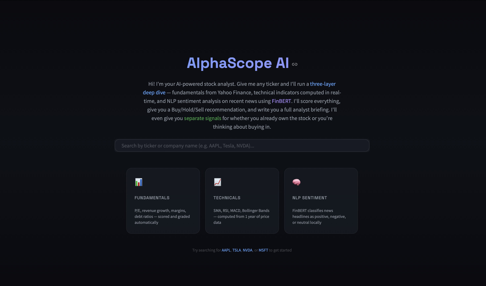
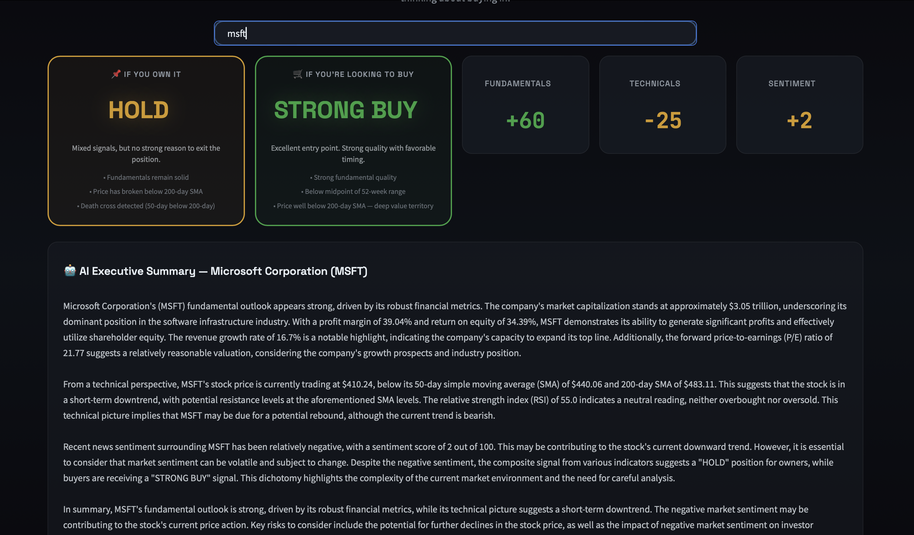
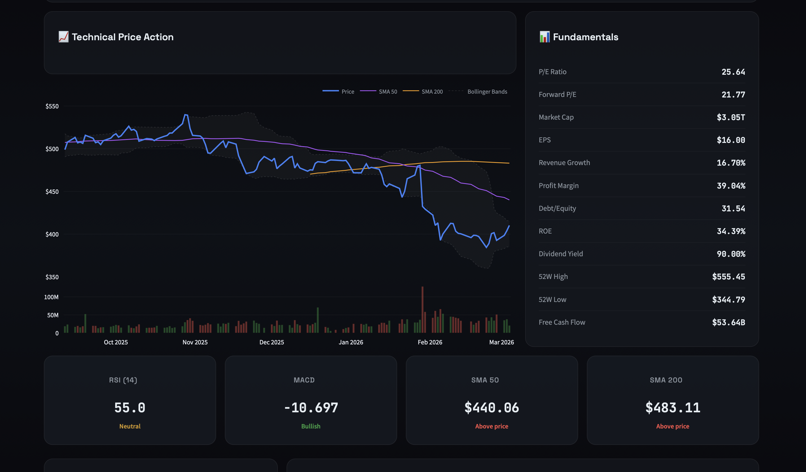

# 🔍 AlphaScope AI

Here's my app: https://alphascope.streamlit.app/
**AI-powered stock analysis engine combining fundamental metrics, technical indicators, and NLP sentiment analysis to generate data-driven Buy/Hold/Sell recommendations with LLM-powered explanations.**

---

## Architecture

AlphaScope runs a **three-layer analysis pipeline** on any stock ticker:

### Layer 1 — Fundamental Analysis
Pulls real-time financial data from Yahoo Finance via `yfinance`. Evaluates P/E ratio, revenue growth, profit margins, debt-to-equity, and ROE. Each metric is scored relative to standard thresholds and aggregated into a fundamental score (-100 to +100).

### Layer 2 — Technical Analysis
Computes indicators from 1 year of historical price data using `pandas`:
- **50-day & 200-day Simple Moving Averages** (trend direction, golden/death cross)
- **RSI (14-period)** (overbought/oversold momentum)
- **MACD (12, 26, 9)** (momentum crossover signals)
- **Bollinger Bands (20, 2σ)** (volatility envelope)

Each indicator contributes to a technical score (-100 to +100).

### Layer 3 — NLP Sentiment Analysis (FinBERT)
Fetches recent news headlines from Yahoo Finance and classifies each through **FinBERT** (`ProsusAI/finbert`), a BERT-based transformer fine-tuned on financial text. The model runs locally — no API calls, no cloud dependency. Each headline receives a positive/negative/neutral label with confidence, mapped to a -100 to +100 scale and averaged into a sentiment score.

### Dual Recommendation System
Unlike single-signal tools, AlphaScope provides **two separate recommendations** based on user context:

**"If You Own It"** — Evaluates sell triggers: deteriorating fundamentals, price breaking below SMA200, death cross patterns, extreme overbought RSI, negative sentiment shifts. Outputs: HOLD / CAUTION / SELL.

**"If You're Looking to Buy"** — Evaluates entry timing on top of quality: position in 52-week range, RSI oversold conditions, proximity to SMA200 support, Bollinger Band positioning, forward vs trailing P/E compression. Outputs: STRONG BUY / BUY / WAIT / AVOID.

Each recommendation includes a summary and the top reasons behind the signal.

### AI Narrative Generation (Groq — Llama 3.3 70B)
All computed data is passed to **Llama 3.3 70B** (via Groq's free inference API) which generates a 3-4 paragraph equity research-style analysis. Every claim in the narrative is grounded in the retrieved data — no hallucinations.

### RAG Chat Interface
Users can ask follow-up questions ("What's the biggest risk?", "Is this overbought?") via a chat interface. The LLM receives the full analysis context and answers grounded in the data.

---

## Tech Stack

| Component | Technology |
|-----------|-----------|
| Frontend / Dashboard | Streamlit, Plotly |
| Financial Data | yfinance (Yahoo Finance) |
| Technical Indicators | pandas, numpy |
| Sentiment NLP | HuggingFace Transformers, FinBERT (ProsusAI/finbert) |
| Narrative / Chat LLM | Groq API (Llama 3.3 70B) |
| Language | Python 3.10+ |

---

## Screenshots

---

## Disclaimer

This tool is for **educational purposes only** and does not constitute financial advice. Always consult a qualified financial advisor before making investment decisions.

---

## License

MIT
